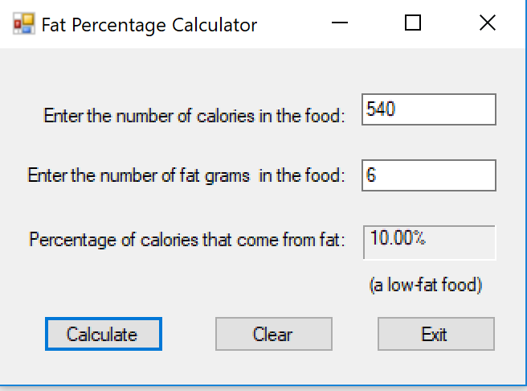

# Fat Percentage Calculator
Fat Percentage Calculator with Visual Basic

## Features
* VB.net
* If the calories from fat are less than 30% of the total calories of the food, it should also display a message indicating the food is low in fat.

## Screenshot

